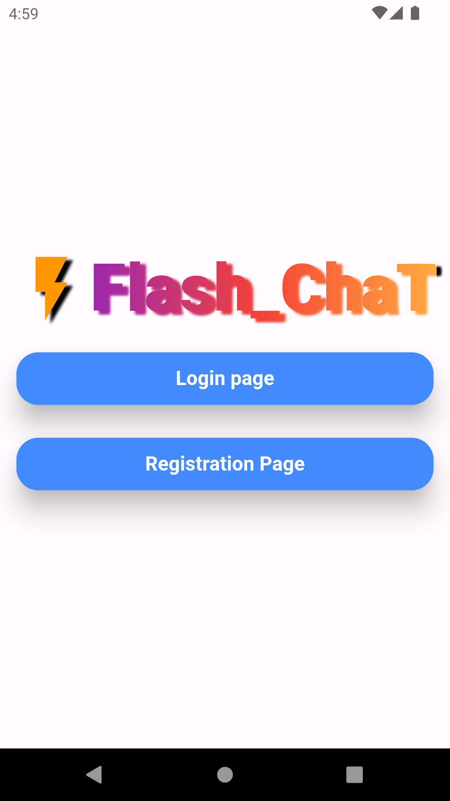
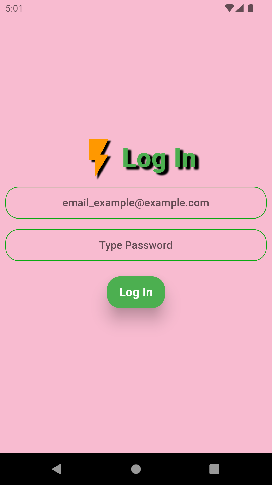
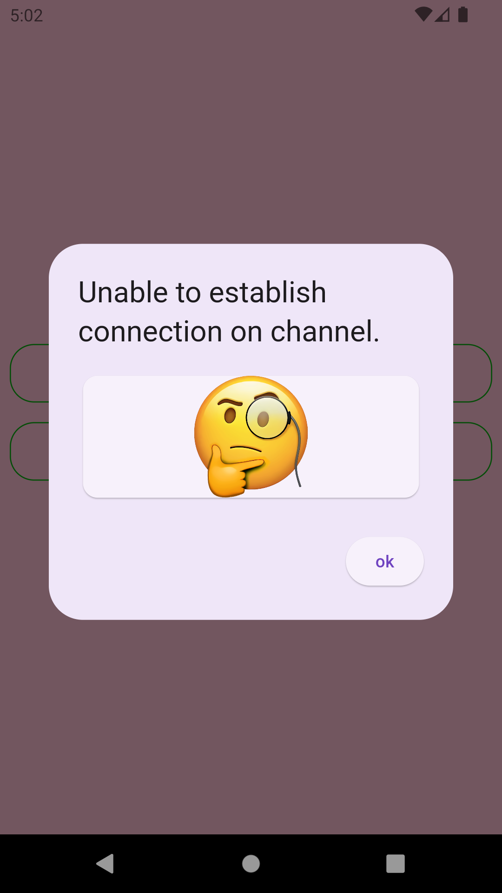
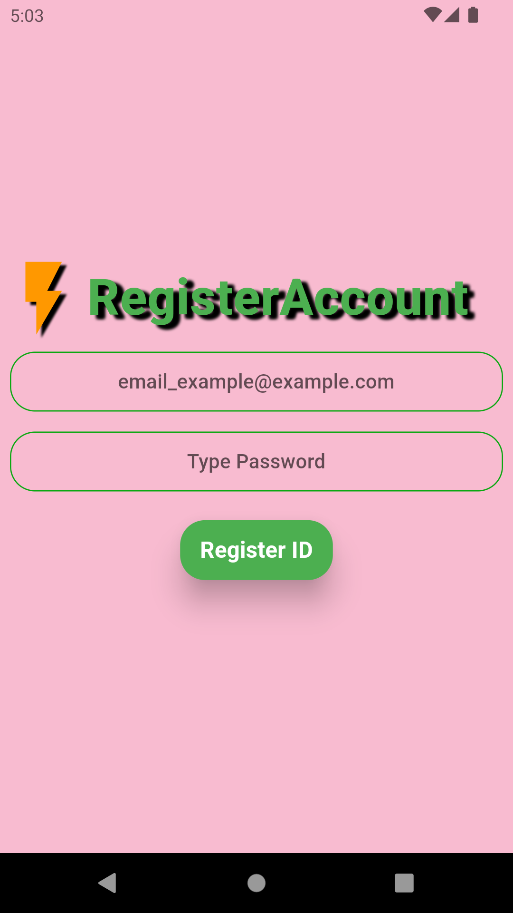
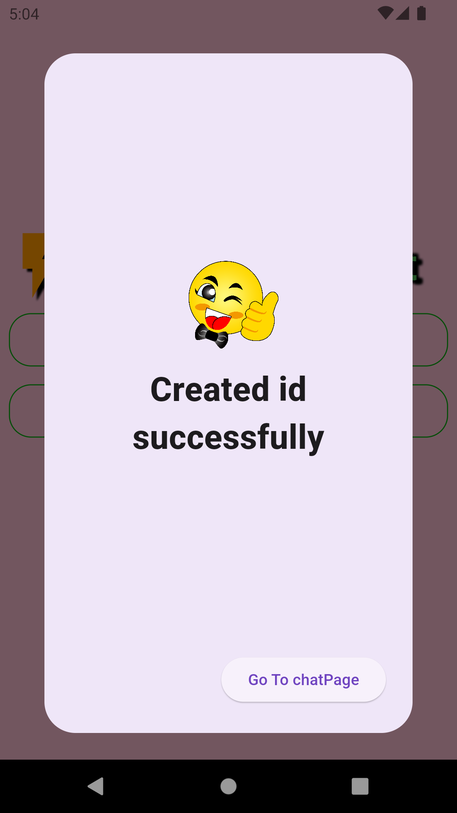
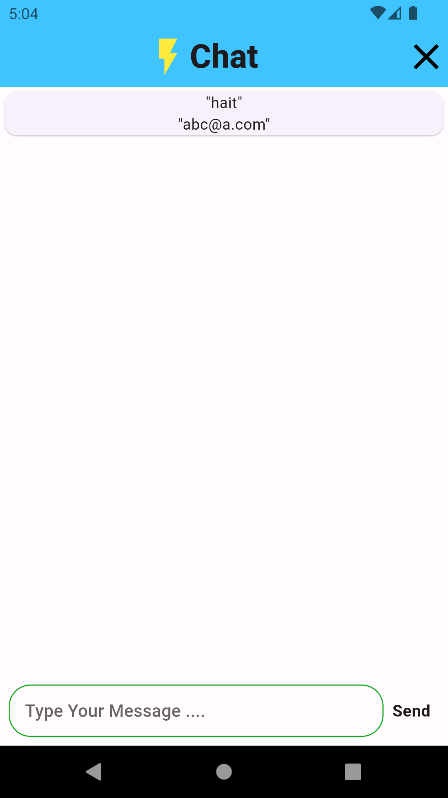

# flast_chat_firebase_example
This is a simplegroup chat  example with firebase 

#### app screenshots

 

## Getting Started

This project is a starting point for a Flutter application.

Edited ffrom another branch example

git add .
git 