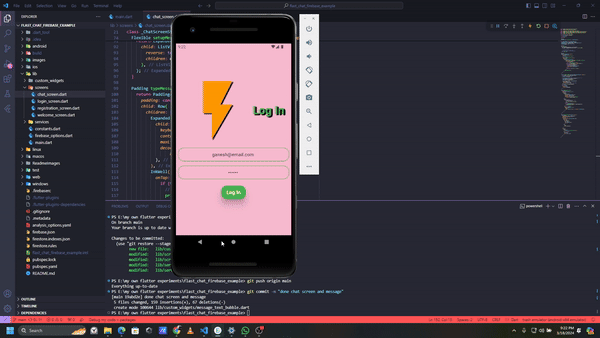
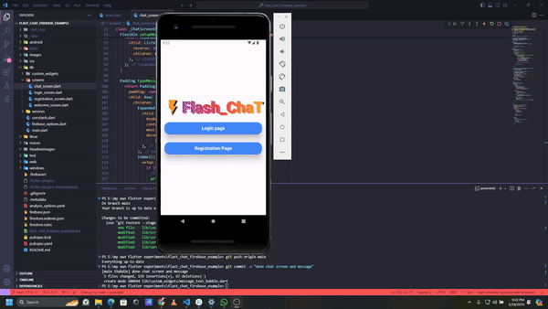
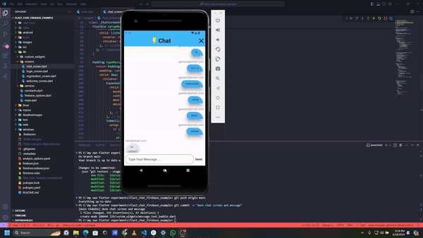
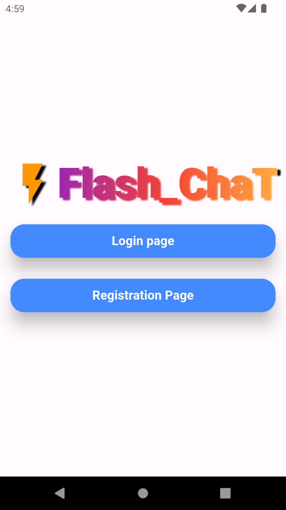
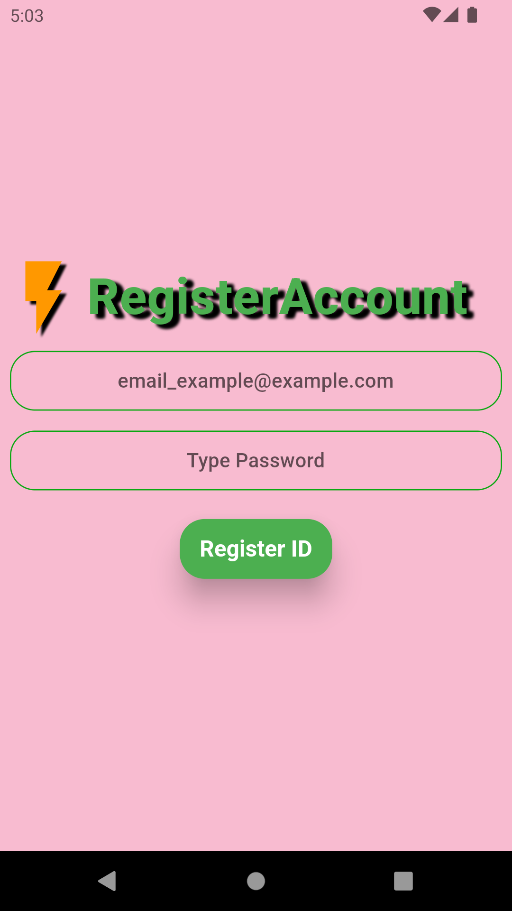
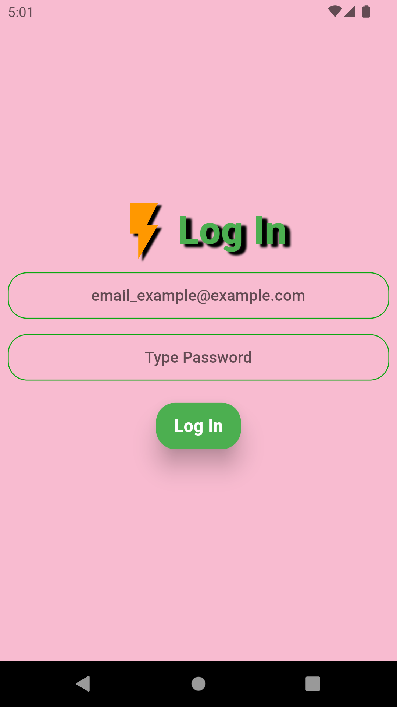
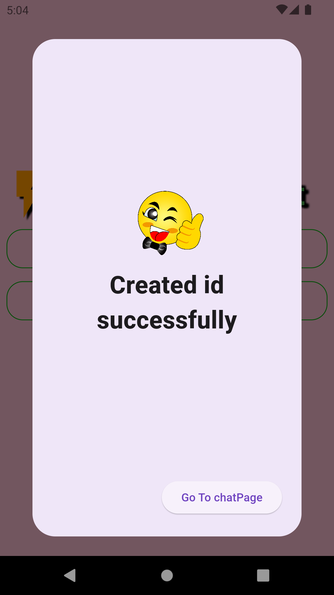
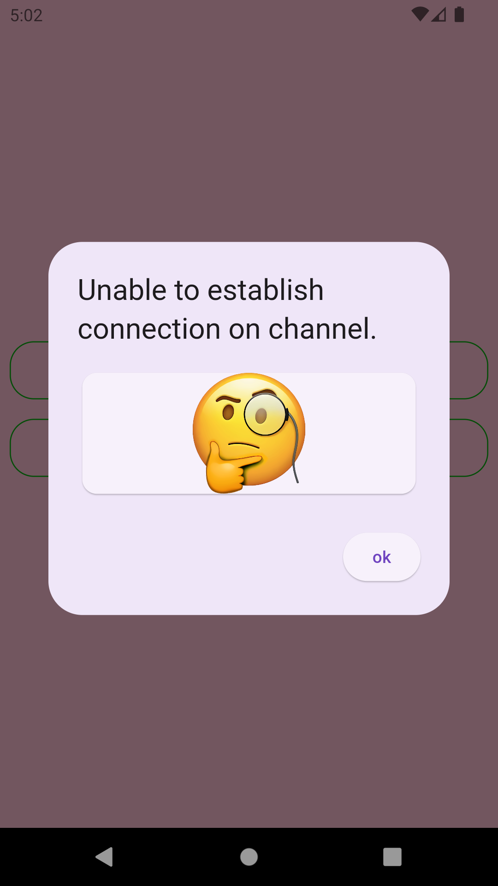
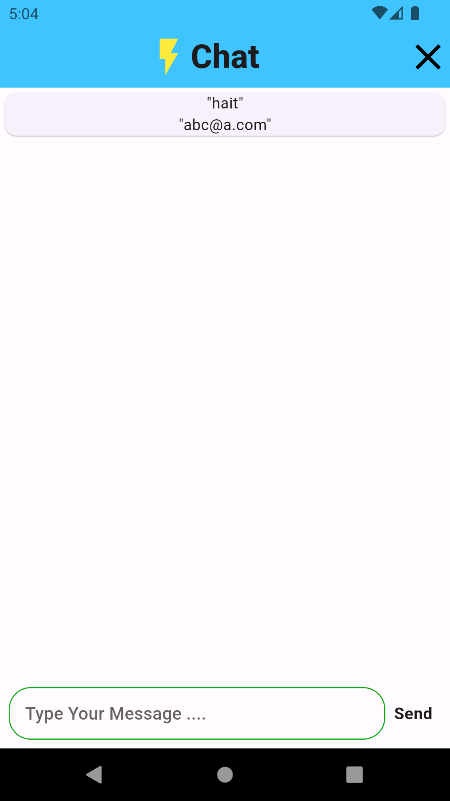

# flast_chat_firebase
This is a simplegroup chat  example with firebase 
# Simple group chat App using flutter
## how App looks
Log in Screen 
  

  
Register Account
  

  
chat Screen
  

  

#### app screenshots

# Details 
 getting started with flutter if intrested u can contact at 
 tamangganesh@hotmail.com